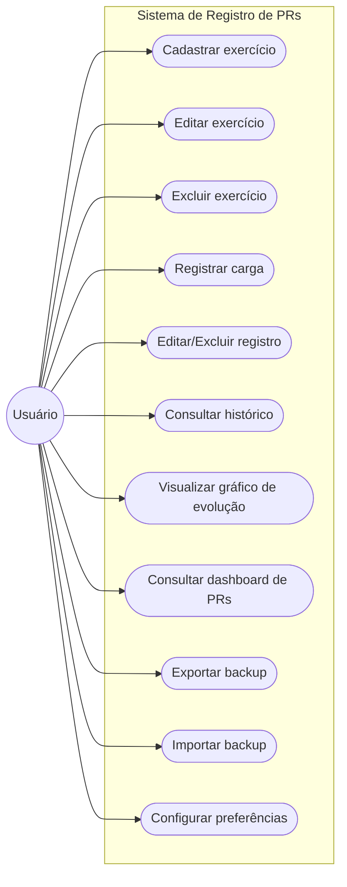
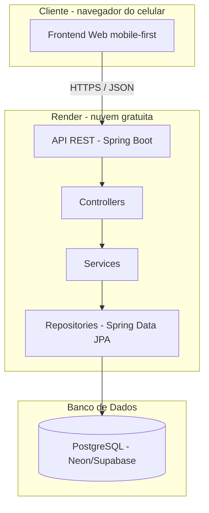
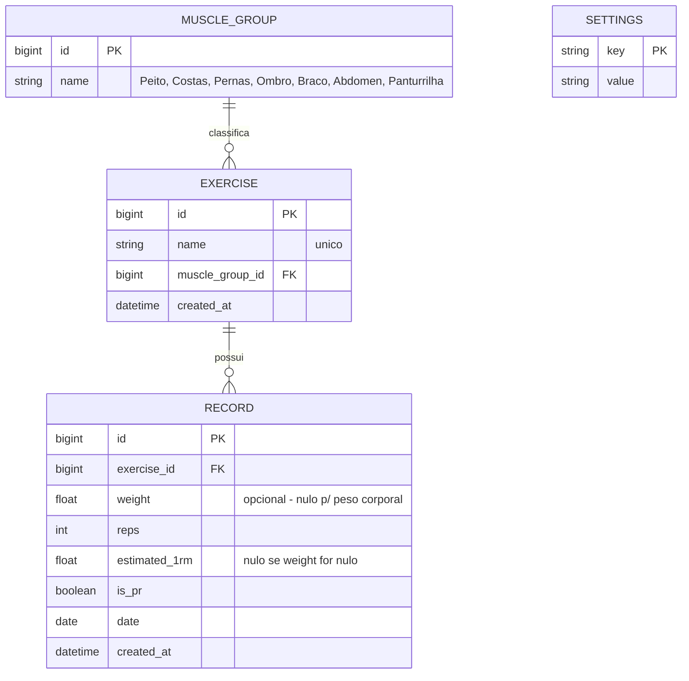
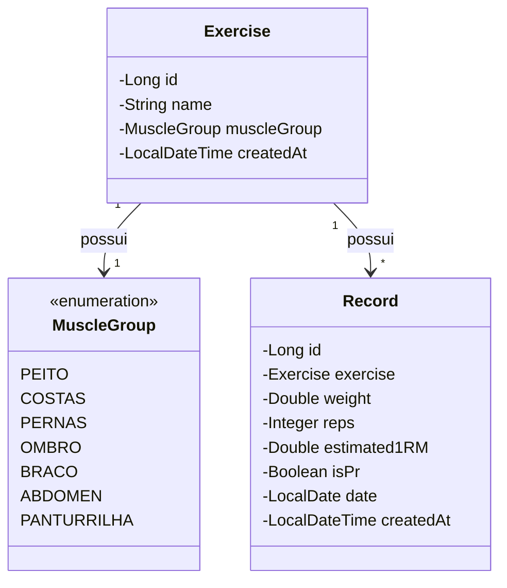
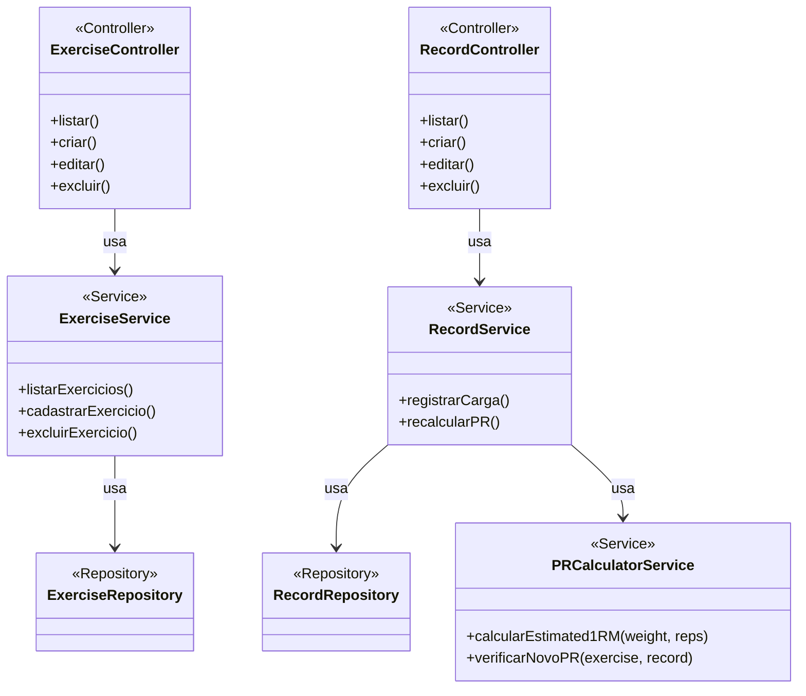
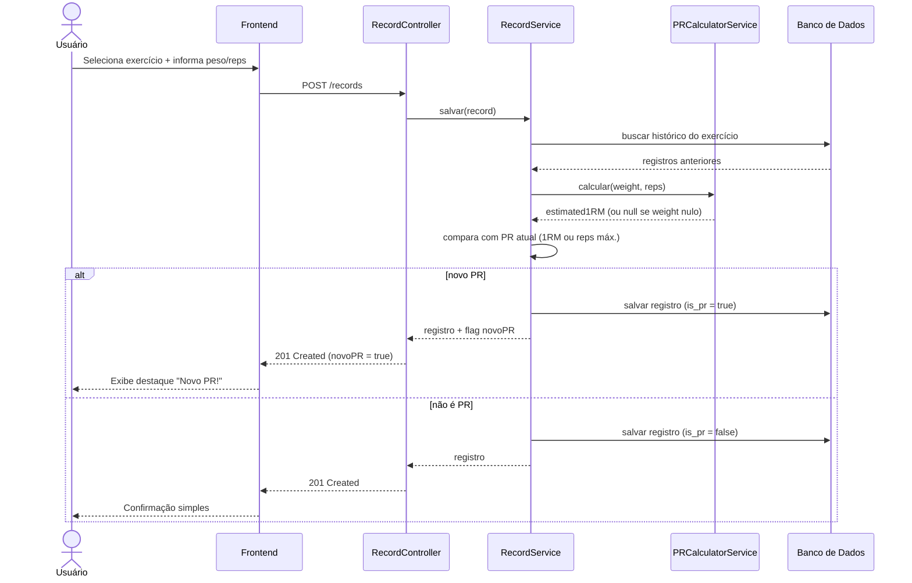
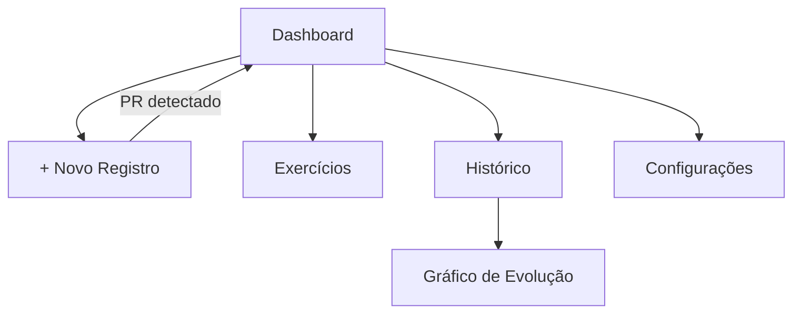

# Documentação Técnica — App de Registro de PRs de Academia

* Projeto acadêmico | Documento de especificação e arquitetura

---

## 1. Documento de Visão

### 1.1 Objetivo do Sistema
Aplicativo pessoal para registrar cargas de treino de forma ultrarrápida e acompanhar a evolução de recordes pessoais (PRs) ao longo do tempo.

### 1.2 Escopo
Sistema single-user, de uso pessoal, acessível via navegador web (mobile-first), com backend próprio e persistência em banco de dados relacional.

### 1.3 Stack Tecnológica

| Camada | Tecnologia | Justificativa |
|--------|-----------|----------------|
| Backend | Java 17+ / Spring Boot | Objetivo de aprendizado + padrão de mercado |
| Persistência | Spring Data JPA | ORM padrão do ecossistema Spring |
| Banco de dados | PostgreSQL (Neon/Supabase — free tier persistente) | Evita expiração de dados presente em bancos gratuitos efêmeros |
| Hospedagem backend | Render (free tier) | Deploy simples via Git, sem necessidade de Docker |
| Frontend | HTML/CSS/JS (mobile-first), evoluindo para PWA | Aprendizado de desenvolvimento web + instalável no celular |
| Comunicação | REST API (JSON sobre HTTPS) | Padrão simples e didático |

### 1.4 Regra de Negócio Central — Definição de PR
- **PR (Recorde Pessoal) = maior 1RM estimado** por exercício, calculado a partir de peso × repetições (fórmula de Epley: `1RM = peso × (1 + reps/30)`).
- **Exceção — exercícios com peso corporal (peso nulo):** quando o campo `weight` de um registro é nulo (ex: barra fixa sem anilha), não é possível calcular 1RM. Nesse caso, o PR do exercício passa a ser o **maior número de repetições** já registrado.
- Cada exercício, portanto, tem seu PR calculado por uma de duas regras, dependendo se already possui algum registro com peso preenchido ou não.

---

## 2. Requisitos Funcionais (RF)

| ID | Requisito | Prioridade |
|----|-----------|------------|
| RF01 | Cadastrar exercícios personalizados (nome único, grupo muscular de lista fixa) | MVP |
| RF02 | Listar exercícios com busca/filtro por nome ou grupo muscular | MVP |
| RF03 | Editar um exercício cadastrado | MVP |
| RF04 | Excluir um exercício — **bloqueado se houver registros vinculados** | MVP |
| RF05 | Registrar uma carga: exercício + peso (opcional, pode ser nulo) + repetições + data (default = hoje) | MVP |
| RF06 | Calcular automaticamente o 1RM estimado no momento do registro (quando peso preenchido) | MVP |
| RF07 | Detectar se o registro é um novo PR — por 1RM (peso preenchido) ou por repetições máximas (peso nulo) | MVP |
| RF08 | Exibir feedback visual imediato quando um novo PR é batido | MVP |
| RF09 | Editar ou excluir um registro já lançado, recalculando o PR do exercício afetado | MVP |
| RF10 | Histórico de cargas por exercício, ordenado por data (mais recente primeiro) | MVP |
| RF11 | Dashboard com resumo dos PRs atuais (um card por exercício) | Etapa 2 |
| RF12 | Filtrar histórico por período (semana / mês / ano / tudo) | Etapa 2 |
| RF13 | Gráfico de evolução do 1RM estimado por exercício ao longo do tempo | Etapa 2 |
| RF14 | Exportar todos os dados em JSON (backup manual) | Etapa 2 |
| RF15 | Importar backup em JSON | Etapa 2 |
| RF16 | Alternar unidade de peso (kg/lb) nas configurações | Etapa 2 |
| RF17 | Modo escuro | Etapa 2 (opcional) |
| RF18 | Transformar em PWA instalável com cache básico | Etapa 2 |

---

## 3. Requisitos Não-Funcionais (RNF)

| ID | Requisito |
|----|-----------|
| RNF01 | Fluxo de registro de carga completável em no máximo 4–5 interações |
| RNF02 | Interface mobile-first, responsiva, uso com uma mão durante o treino |
| RNF03 | Backend Java/Spring Boot organizado em camadas (Controller → Service → Repository) |
| RNF04 | API protegida por autenticação simples (token/senha) — dados hospedados publicamente, mas privados |
| RNF05 | Operações de CRUD devem responder em menos de 300ms em uso normal |
| RNF06 | Banco de dados persistente (sem expiração automática de dados) |
| RNF07 | Backup e restauração via arquivo JSON, sem dependência de conta de terceiros |
| RNF08 | Nenhum dado enviado para serviços de terceiros além da própria infraestrutura do projeto |
| RNF09 | Sistema tolerante à latência de cold start do free tier (feedback de carregamento ao usuário) |

---

## 4. Diagrama de Casos de Uso

---

## 5. Diagrama de Arquitetura (Camadas)

---

## 6. Diagrama Entidade-Relacionamento (DER)

**Observações do modelo:**
- `MUSCLE_GROUP` é uma **tabela de referência** (lookup table) que representa a lista fixa de grupos musculares. Em vez de gravar o texto "Peito" repetido em cada exercício, guardamos só o `id` — é a forma correta de normalizar um enum/lista fixa em um banco relacional, evitando erros de digitação e facilitando alterar a lista no futuro. Ela é pré-populada (seed) na criação do banco, o usuário não cadastra grupos musculares novos.
- `estimated_1rm` é calculado no momento do salvamento (fórmula de Epley) e persistido, para permitir consultas rápidas de histórico/gráfico sem recalcular toda vez.
- `is_pr` reflete se aquele registro era o recorde vigente no momento em que foi salvo. É recalculado sempre que um registro do mesmo exercício é criado, editado ou excluído.
- `SETTINGS` é uma tabela chave-valor simples (unidade kg/lb, tema), sem relação com as demais — sistema é single-user.

---

## 7. Diagrama de Classes (Backend Java)

Um diagrama de classes único misturaria dois conceitos diferentes: os **dados** que o sistema manipula e as **classes de código** que implementam a lógica. Por isso, este documento separa em dois diagramas complementares.

### 7.1 Classes de Domínio — o "quê" do sistema
Representam diretamente as entidades do DER (seção 6): os dados que o sistema guarda.

### 7.2 Classes de Componente — o "como" do sistema
Representam as classes Java responsáveis pela lógica, seguindo o padrão em camadas do Spring Boot (Controller → Service → Repository). Cada uma dessas classes manipula as entidades de domínio da seção 7.1.

**Como ler:** uma requisição HTTP chega no `Controller`, que delega a regra de negócio pro `Service`, que usa o `Repository` pra conversar com o banco (isso é o mesmo fluxo já resumido na seção 5). O `PRCalculatorService` é uma classe separada só pra lógica de cálculo de PR — isolá-la assim facilita escrever testes unitários nela sem precisar de banco de dados (ver seção 11, item 4).

---

## 8. Diagrama de Sequência — Fluxo Principal (Registrar Carga)

---

## 9. Fluxo de Navegação (Telas)

